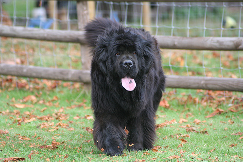
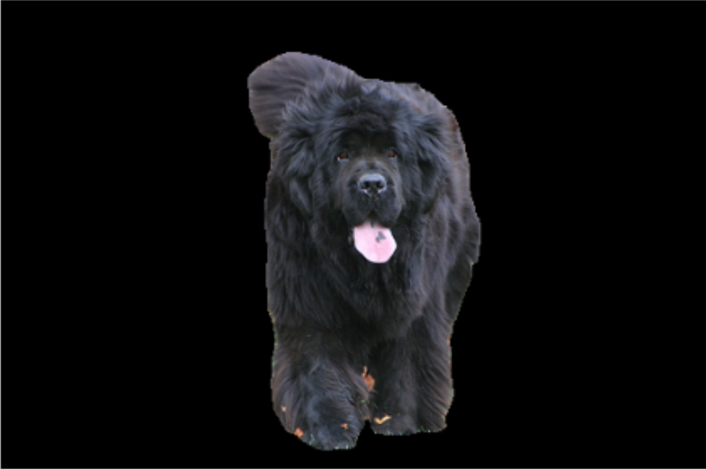

## Pet Image Segmentation with Enhanced UNet and SAM
This project focuses on semantic segmentation of pet images using an enhanced UNet architecture and Segment Anything Model (SAM) for mask refinement. The goal is to improve segmentation accuracy on the Oxford-IIIT Pet Dataset by refining ground truth masks with SAM and introducing architectural improvements to the standard UNet.

### Dataset
The project uses The Oxford-IIIT Pet Dataset, which contains images of 37 pet breeds with corresponding segmentation masks. The dataset includes:

* 7,349 images (3,669 cats and 3,680 dogs).
* Annotated class labels and segmentation masks.

### Project Pipeline
1. Data Preparation & EDA
   * Custom dataset class for loading images and masks.
   * Exploratory Data Analysis (EDA) to understand data distribution and mask quality.
2. Mask Refinement with SAM
   * Uses Meta's Segment Anything Model (SAM) to refine ground truth masks for higher precision.
3. UNet Enhancements
   * Modular UNet-like architecture with customizable components.
   * Replace standard blocks with advanced modules:
        * MBConv (MobileNetV2-style inverted residuals).
        * CBAM (Convolutional Bottleneck Attention Module).
        * Other efficiency/performance-focused modifications.
4. Training Pipeline
   * End-to-end training with refined masks.
   * Supports metrics (IoU) and visualization of predictions.

### How to use:
1. Download data from: https://www.kaggle.com/datasets/devdgohil/the-oxfordiiit-pet-dataset/data
2. ```git clone https://github.com/daniel-turpakov/segmentation_oxford_pets.git```
3. ```cd segmentation_oxford_pets```
4. ```pip3 install -r requirements.txt```
5. ```python3 train.py```

### Example segmentation:
<div style="display: flex; justify-content: space-between;">
  
  
</div>
